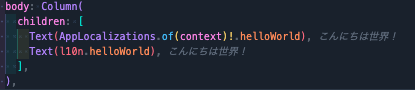

# Flutter L10n Helper

VS Code extension for displaying localized text inline in Flutter code. This extension specifically supports Flutter's ARB (Application Resource Bundle) files only.



## Features

- Shows actual localized text from ARB files next to l10n keys in your code
- Supports flexible matching with custom regex patterns
- Displays translations in italics at the end of the code line
- Truncates long translations with ellipsis (configurable character limit)

## Installation

1. Open VS Code
2. Go to Extensions view (Ctrl+Shift+X / Cmd+Shift+X)
3. Search for "Flutter L10n Helper"
4. Click "Install"

## Configuration

You can configure the extension through VS Code settings:

1. Go to File > Preferences > Settings (or Code > Preferences > Settings on macOS)
2. Search for "Flutter L10n Helper"
3. Adjust the settings as needed

### Minimal Configuration

For most projects, the minimal configuration in your `settings.json` would be:

```json
{
  "flutterL10nHelper.arbPath": "lib/l10n",
  "flutterL10nHelper.preferredLocale": "ja"
}
```

This will use all the default patterns and standard settings.

### Full Configuration

For complete customization, you can use the full configuration:

```json
{
  "flutterL10nHelper.arbPath": "lib/l10n",
  "flutterL10nHelper.preferredLocale": "ja",
  "flutterL10nHelper.maxTextLength": 20,
  "flutterL10nHelper.useDefaultPatterns": true,
  "flutterL10nHelper.customPatterns": [
    { "pattern": "customL10n\\.([a-zA-Z0-9_]+)", "captureGroup": 1 },
    { "pattern": "myTranslation\\.([a-zA-Z0-9_]+)", "captureGroup": 1 }
  ]
}
```

> **Note**: In `settings.json`, backslashes (`\`) must be double-escaped. The examples above already have the correct escaping. For example, `.` is written as `\\.`.

### Settings Explained

- `flutterL10nHelper.arbPath`: Path to ARB files relative to workspace root
- `flutterL10nHelper.preferredLocale`: Preferred locale to display (e.g., "ja" for Japanese)
- `flutterL10nHelper.maxTextLength`: Maximum length of displayed text (longer text will be truncated with "...")
- `flutterL10nHelper.useDefaultPatterns`: Whether to use the built-in default patterns (set to `false` to use only custom patterns)
- `flutterL10nHelper.customPatterns`: Array of regex patterns (optional if using default patterns)

### Default Patterns

The extension includes the following default patterns when `useDefaultPatterns` is enabled (default):

```javascript
// 1. AppLocalizations.of(context).helloWorld
{ "pattern": "AppLocalizations\\.of\\(\\s*\\w+\\s*\\)([?!])?\\.(\\w+)", "captureGroup": 2 }
// Example: Text(AppLocalizations.of(context)?.welcome_message) // Displays: Welcome to our app
// Example: Text(AppLocalizations.of(context)!.header_title) // Displays: Dashboard
// Example: Text(AppLocalizations.of(context).welcome_message) // Displays: Welcome to our app

// 2. appLocalizations.helloWorld
{ "pattern": "appLocalizations\\.(\\w+)" }
// Example: Text(appLocalizations.submit_button) // Displays: Submit

// 3. context.l10n.hello_world
{ "pattern": "context\\.l10n\\.([a-zA-Z0-9_]+)" }
// Example: Text(context.l10n.cancel_action) // Displays: Cancel

// 4. l10n.welcome_message
{ "pattern": "(?<!\\w)l10n\\.([a-zA-Z0-9_]+)" }
// Example: Text(l10n.welcome_message) // Displays: Welcome to our app

// 5. L10n.of(context).cancel_button
{ "pattern": "L10n\\.of\\(\\s*\\w+\\s*\\)([?!])?\\.(\\w+)", "captureGroup": 2 }
// Example: Text(L10n.of(context)!.cancel_button) // Displays: Cancel
// Example: Text(L10n.of(context)?.ok_button) // Displays: OK
// Example: Text(L10n.of(context).ok_button) // Displays: OK
```

These patterns have the global flag enabled and use properly escaped regular expressions in the actual implementation.

### Custom Regex Patterns

The extension uses regex patterns to detect l10n keys. You can add custom patterns if your project uses specific patterns not covered by the defaults.

Each pattern requires:

- `pattern`: Regex pattern string with capture groups to identify the l10n key
- `captureGroup`: (Optional) Which capture group contains the l10n key (1 for first group, 2 for second, etc.). Defaults to 1 if not specified.

#### Example Custom Pattern

Here's an example of a custom pattern for a custom localization setup:

```json
"flutterL10nHelper.customPatterns": [
  { "pattern": "customTranslator\\.get\\('([^']+)'\\)" }
]
```

This would match code like: `customTranslator.get('my_key')` and use the first capture group by default.

If you need to specify a different capture group:

```json
"flutterL10nHelper.customPatterns": [
  { "pattern": "myTranslator\\.get\\(([0-9]+), '([^']+)'\\)", "captureGroup": 2 }
]
```

This would match code like: `myTranslator.get(123, 'my_key')` and use the second capture group.

## Commands

- `Flutter L10n Helper: Reload ARB Files`: Reload ARB files when they've been changed

## How It Works

The extension reads ARB files from your project and displays translations as comments next to l10n keys in your code. This lets you understand what the localized text is without having to look up the keys in ARB files.

For example, with this code:

```dart
Text(AppLocalizations.of(context)?.ok_button)
```

It will display:

```dart
Text(AppLocalizations.of(context)?.ok_button) OK
```

Long translations will be truncated (if they exceed the length specified in `flutterL10nHelper.maxTextLength`):

```dart
Text(AppLocalizations.of(context)?.very_long_text) This is a very long...
```

## Troubleshooting

If translations don't appear:

1. Verify the ARB path is correct (`flutterL10nHelper.arbPath`)
2. Check that your preferred locale exists in the ARB files
3. Use the `Flutter L10n Helper: Reload ARB Files` command to reload the ARB files
4. Confirm you are using Flutter's ARB format files (.arb extension) - this extension does not support other localization formats like .json or .strings files
